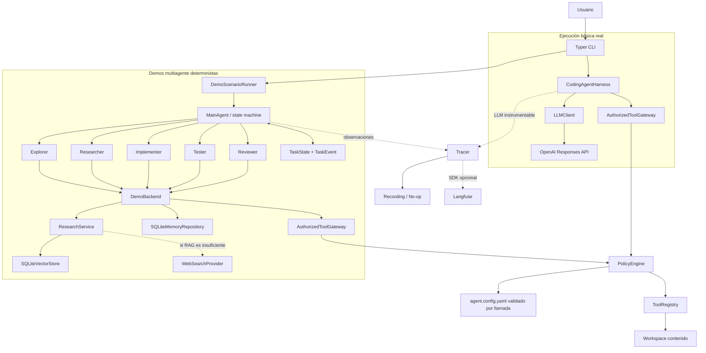
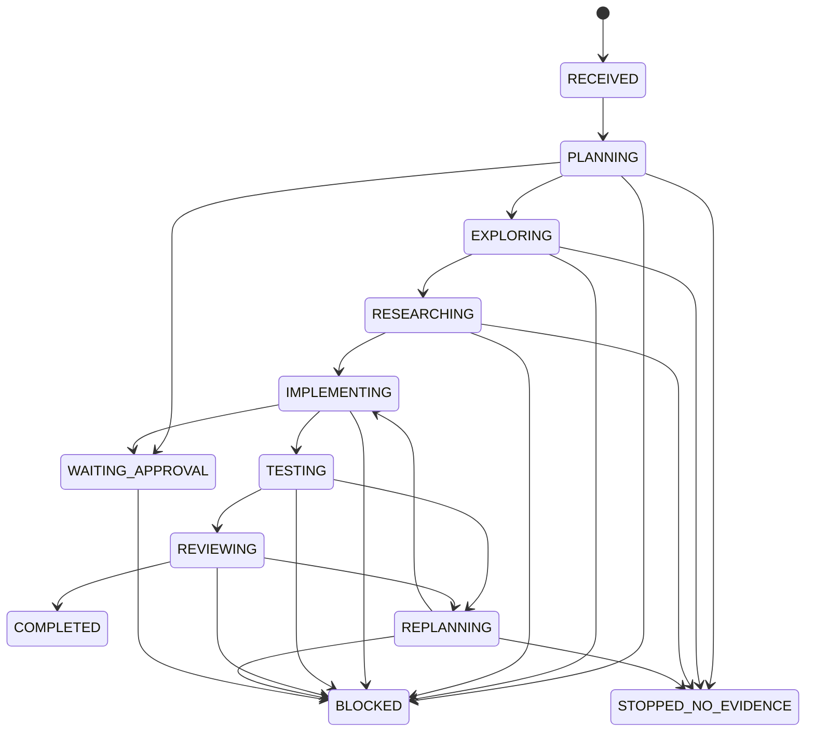
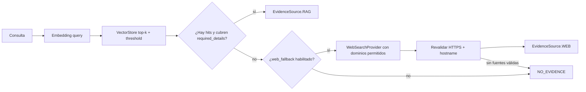

# Arquitectura implementada

## Alcance y decisiones

El producto es un paquete Python con layout `src/`. Conserva el loop y las tools
del notebook legado, pero reemplaza globals, paths de Colab, `shell=True`,
`input()` en el núcleo y Chat Completions por contratos tipados, policy gateway,
Responses API y una máquina de estados propia.

Decisiones vigentes:

- orquestación propia, sin LangChain, LangGraph, CrewAI, AutoGen, OpenAI Agents
  SDK ni frameworks equivalentes;
- SDK oficial OpenAI directo para Responses y embeddings;
- estado y resultados Pydantic inmutables;
- memoria y vector store persistentes en SQLite;
- Langfuse opcional con fallback no-op;
- proveedores externos detrás de interfaces para usar fakes;
- CLI reproducible y fixture FastAPI bajo `examples/`.

## Dos superficies de ejecución

La arquitectura existe, pero hoy hay dos composiciones diferentes:

1. `coding-agent run` conecta `CodingAgentHarness` con
   `OpenAIResponsesClient` y las tools de Implementer. Conserva plan mode,
   supervisión y límite de iteraciones, pero no usa `MainAgent` ni los cinco
   roles.
2. `coding-agent demo ...` conecta `MainAgent`, cinco subagentes, policy, RAG,
   memoria y tracing recording. Su `DemoBackend` es determinista y contiene los
   cambios esperados de los escenarios; no llama a un LLM.

No existe todavía una tercera composición que una OpenAI con la máquina de
estados multiagente. `coding-agent demo real` sólo verifica variables/SDK y
termina sin llamada externa.

## Diagrama

## Límites de módulos

| Módulo | Responsabilidad implementada | Límite explícito |
|---|---|---|
| `cli` | Parsear comandos y componer config, harness, RAG y demos. | No decide transiciones ni autoriza recursos. |
| `config` | YAML estricto, expansión `${VAR}`/`${VAR:-default}`, settings desde entorno y workspace canónico. | No lee `.env` implícitamente. |
| `models` | Requests/responses LLM, tool calls, errores, policy y statuses básicos. | No ejecuta efectos. |
| `llm` | Puerto `LLMClient` y adaptador Responses API. | No coordina subagentes. |
| `harness` | Loop LLM-tool, historial, plan/supervisión y máximo de iteraciones. | Sólo ejecuta bindings ya compuestos; no contiene policy. |
| `tools` | Contrato común, registry y tools filesystem/shell/repo/web. | No decide permisos por sí solo. |
| `policies` | Recargar config, autorizar rol/recurso/comando, pedir aprobación y redactar. | La aprobación no amplía el set de tools del rol. |
| `state` | Modelos de tarea y grafo de transiciones append-only. | Los agentes no reciben ni mutan `TaskState`. |
| `agents` | Responsabilidad, contrato de resultado y toolbox acotada por rol. | La lógica concreta está en un `AgentBackend` inyectado. |
| `orchestrator` | Plan, secuencia de roles, acumulación, contexto, aprobación, replan y terminales. | Consume puertos; no llama SDKs directamente. |
| `memory` | Repository SQLite por proyecto, búsqueda lexical, freshness y provenance. | No convierte automáticamente texto del modelo en hecho. |
| `context` | Selección presupuestada, resumen mediante puerto y detección de no-progreso. | Expone qué se incluyó/omitió y no recibe el repositorio completo. |
| `rag` | Loaders, chunking, embeddings, store, retrieval y RAG-first/web fallback. | Tavily se habilita sólo en la demo real y con presupuesto propio. |
| `observability` | Puerto, sanitización, no-op, recording y adaptador Langfuse opcional. | Nunca modifica el resultado funcional ante una falla. |
| `demo` | Reset seguro, escenarios deterministas y composición real acotada. | La corrida real exige credenciales y confirmación explícita de costo. |

## Roles y contexto

`MainAgent` recibe `TaskRequest`, normaliza el objetivo, crea/versiona el plan,
construye un `AgentContext` por rol, acumula `AgentResult` y es el único que usa
`TaskStateMachine`. Los contextos son copias tipadas con la porción necesaria:

| Rol | Responsabilidad | Contexto previo visible | Tools asignables |
|---|---|---|---|
| Explorer | Estructura, arquitectura, dependencias, convenciones y archivos. | Pedido, objetivo, plan y criterios. | read/list/search/status y comando de inspección. |
| Researcher | Evidencia atribuible; RAG primero y web si falta evidencia. | Resumen de Explorer, evidencias y archivos descubiertos. | `web_search`; RAG entra por `ResearchProvider`. |
| Implementer | Proponer/aplicar sólo cambios autorizados. | Explorer, Researcher, evidencia y plan. | read/list/search/write/status; sin `run_command`. |
| Tester | Ejecutar checks concretos y conservar resultados reales. | Implementer, cambios, errores y criterios. | read/list/search/run/status. |
| Reviewer | Comparar pedido, criterios, diff y checks. | Todos los roles, evidencia, cambios, checks y observaciones. | read/list/search/status; sin write. |

`ScopedToolbox` filtra bindings por allowlist del agente. Si el backend intenta
usar una tool no asignada, falla con `ToolAccessError` antes del handler. Si la
tool sí está asignada, el gateway igualmente revalida rol, configuración,
recurso y comando.

## Estado compartido

`TaskState` es inmutable. Contiene request, objetivo, plan/version, status/fase,
resultados por agente, evidencia, fuentes, archivos leídos/cambiados, tools,
comandos, aprobaciones, errores, observaciones, decisiones, iteraciones,
replans, eventos y resultado final. Cada transición válida incrementa
`revision` y agrega un `TaskEvent` secuencial.

Los tipos de fuente son deliberadamente distintos:

- `repository`: contenido observado en el workspace;
- `memory`: registro persistido de una sesión anterior;
- `rag`: chunk recuperado del vector store;
- `web`: resultado de una fuente HTTPS permitida;
- `tool_output`: salida directa de una tool;
- `inference`: conclusión propia, válida sólo si enumera evidencias de soporte.

El resultado final crea un grupo para cada tipo, incluso si está vacío. El
detalle del modelo y SQLite está en
[`state_and_memory.md`](state_and_memory.md).

## Estados y flujo normal

El grafo real también permite `FAILED` desde fases no terminales y reanudar una
aprobación hacia `EXPLORING`, `IMPLEMENTING` o `REPLANNING`. No existe un estado
`CANCELLED`.

Flujo nominal de la demo:

1. reset contenido de la fixture y creación de IDs;
2. plan inicial y transición a Explorer;
3. Explorer usa tools y produce evidencia de repositorio;
4. Researcher recupera RAG o memoria según escenario;
5. Implementer aplica writes autorizados;
6. Tester ejecuta subprocess con argv y registra checks;
7. Reviewer valida scope/criterios;
8. Main construye `TaskFinalResult` y artifacts.

## Flujo ante fallo

1. Una excepción de agente genera error tipado y transición `FAILED`.
2. `NO_EVIDENCE` termina en `STOPPED_NO_EVIDENCE` con la brecha declarada.
3. Un bloqueo explícito termina `BLOCKED`.
4. Fallo de Tester o rechazo de Reviewer entra a `REPLANNING` si queda
   presupuesto y vuelve a Implementer.
5. Si `max_replans` se agotó, termina `BLOCKED` sin `final_result`.
6. Un fallo de tracing se ignora de manera controlada, pero el error de dominio
   conserva su comportamiento.

El escenario C ejercita los pasos 4 y 5: dos fallos equivalentes, un replan y
bloqueo, sin tercera repetición.

## RAG primero y web como fallback

La suficiencia implementada exige al menos un hit sobre threshold y que los
strings de `required_details` aparezcan en los chunks combinados. No evalúa
diversidad o actualidad más allá de metadata/versionado. Web se llama a lo sumo
una vez por `ResearchService.research`; URLs fuera del allowlist se descartan.

## Flujo de aprobación humana

Hay dos mecanismos relacionados:

1. El gateway puede obtener una decisión sincrónica de `ApprovalProvider`. En
   CLI, `TyperApprovalProvider` muestra argumentos y confirma; en tests se usa
   fake. Sin proveedor/aprobación, una acción `requires_approval` no se ejecuta.
2. `MainAgent` puede pausar el plan o aceptar un `AgentResult` con
   `PendingApproval`, devolver `WAITING_APPROVAL` y luego ejecutar
   `resume(state, decision)`. Un rechazo transiciona a `BLOCKED`.

En ambos casos, configuración y policy se evalúan antes del efecto. Silencio no
equivale a aprobación. La demo C registra las decisiones pendientes, pero no
pausa/reanuda una aprobación humana real.

## Estrategia de no-progreso

`NoProgressDetector` normaliza fingerprints de tool/argumentos relevantes,
comandos, lecturas, errores y resultados. Detecta acción repetida, mismo error,
relectura sin progreso, ciclo A-B-A-B, límite de iteraciones y fases estancadas.
Cada señal elige `change_strategy`, `replan`, `stop`, `ask_help` o
`request_evidence_or_permission`, e indica si la próxima ejecución está
permitida. Evidencia o cambios nuevos reinician contadores.

La demo C integra la señal de error repetido con un replan. El backend OpenAI
real instancia el detector por rol, bloquea antes de una tercera acción igual y
envía `loop.no_progress` al tracer compartido. Más detalle en
[`context_and_loop_detection.md`](context_and_loop_detection.md).

## Persistencia y observabilidad

- memoria: `data/memory/project_memory.sqlite` según configuración;
- vectores: `data/vector_store/vectors.sqlite3` según configuración;
- artifacts de demo: `docs/evidence/runs/<run_id>`;
- observabilidad: no-op si está deshabilitada/no configurada; recording en
  demos/tests; Langfuse en `demo real` con SDK, credenciales y trace id.

Antes de persistir un artifact, el writer sustituye workspace, intérprete y
home locales por `${WORKSPACE}`, `${PYTHON}` y `${HOME}`. Esto afecta sólo la
representación entregable, no el comando que efectivamente se ejecuta.

Los artifacts deterministas entregados no son trazas Langfuse. Su `trace_id` es
`null`. La ejecución real completa `real-openai-20260716-231650` tiene trace id
`8248244a2224f1dc099fff1240e5c040`, tests exitosos y Reviewer aprobado.
